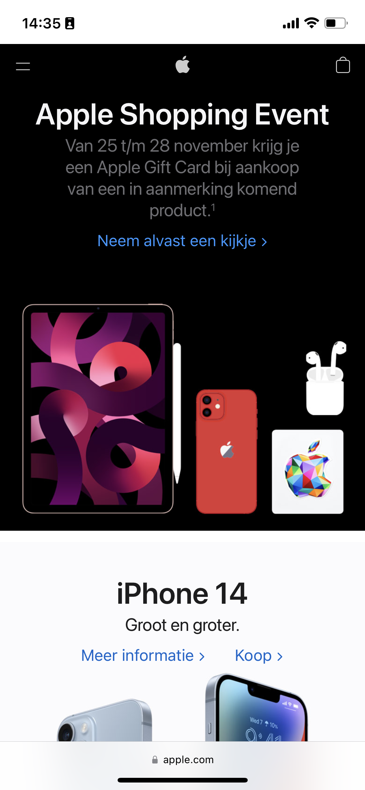
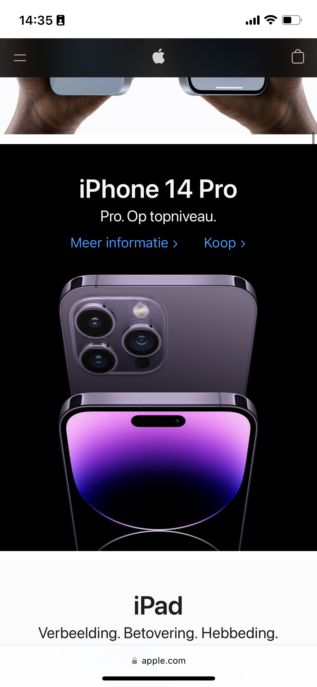
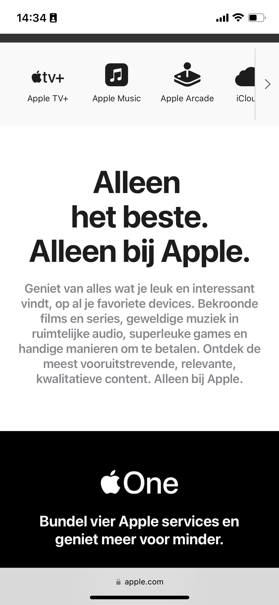
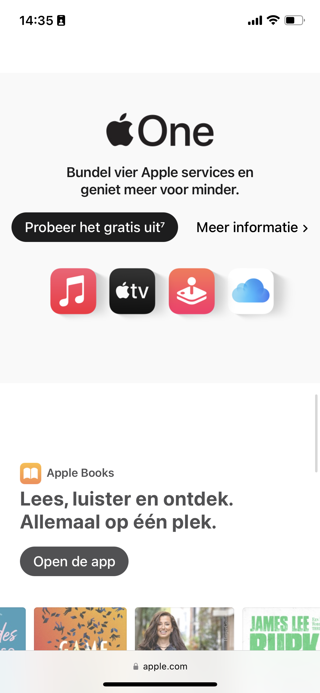
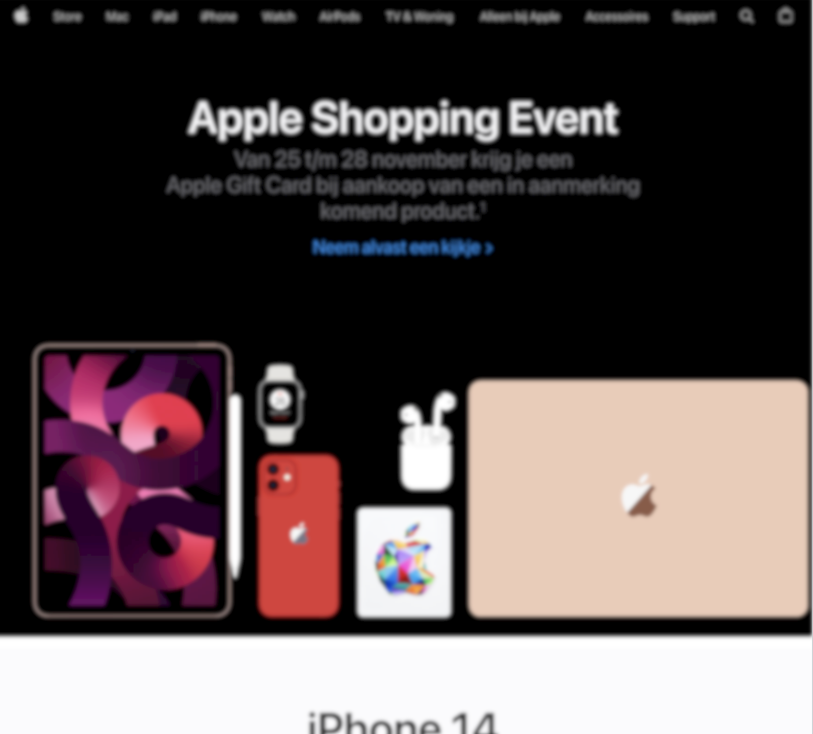

# Procesverslag
Markdown is een simpele manier om HTML te schrijven.  
Markdown cheat cheet: [Hulp bij het schrijven van Markdown](https://github.com/adam-p/markdown-here/wiki/Markdown-Cheatsheet).

Nb. De standaardstructuur en de spartaanse opmaak van de README.md zijn helemaal prima. Het gaat om de inhoud van je procesverslag. Besteedt de tijd voor pracht en praal aan je website.

Nb. Door *open* toe te voegen aan een *details* element kun je deze standaard open zetten. Fijn om dat steeds voor de relevante stuk(ken) te doen.

## Jij

  
uitwerken voor kick-off werkgroep

  ### Auteur:
  Chiara Enters

  #### Je startniveau:
  Rood

  #### Je focus:
  Surface plane
 

## Je website

  
uitwerken voor kick-off werkgroep

  ### Je opdracht:
  https://www.apple.com/nl/

  #### Screenshot(s) van de eerste pagina (small screen): 
  Thuispagina  
   
  
  

  #### Screenshot(s) van de tweede pagina (small screen):
  Services pagina 
  
  
  
 

## Toegankelijkheidstest 1/2 (week 1)

  
uitwerken na test in 1e werkgroep

  ### Bevindingen
  Lijst met je bevindingen die in de test naar voren kwamen:
  - Apple website heeft geen <header> door het gehele website
  - Alle sections op de thuispagina zijn links naar de pagina, very touch sensitive voor wanneer je alleen wilt scrollen

  #### Screenreader
  Hier korte omschrijving (met indien nodig afbeeldingen)

  Hier een omschrijving van hoe het opgelost kan worden (met indien nodig afbeeldingen)

  #### Muis en Toetsenbord 
  Hier korte omschrijving (met indien nodig afbeeldingen)

  Hier een omschrijving van hoe het opgelost kan worden (met indien nodig afbeeldingen)

  #### Motoriek (shocks, elastiekjes)
  Hier korte omschrijving (met indien nodig afbeeldingen)

  Hier een omschrijving van hoe het opgelost kan worden (met indien nodig afbeeldingen)

  #### Visueel (brillen, contrast, kleurenblind, dark/light). 
  Apple heeft niet per se voor alle visuele beperkingen een uitzondering gemaakt, denk aan blurry vision. Maar door de hoge contrast in de website opmaak is de content in alle gevallen duidelijk. Er is geen verschil in de light\dark modus. Voor het geval dat een persoon met een bril een keer zonder bril de apple website moet navigeren, dan kan het nog net door de grote onderscheid in lettergrootte en kleur contrast.
  
  

  Voor dit onderdeel weet ik zelf geen verbetering om toe te voegen zonder de opmaak nadelig aan te passen.

## Breakdownschets (week 1)

  
uitwerken na afloop 2e werkgroep

  ### de hele pagina: 
  
  

  ### dynamisch deel (bijv menu): 
  

## Voortgang 1 (week 2)

  
uitwerken voor 1e voortgang

  ### Stand van zaken
  - Ik moet mijn toegankelijksheid analyse nog afmaken.
  - Ik ben begonnen met de breakdown schetsen om te kijken hoe de website van Apple in semantisch HTML eruit zal zien.
  Het lastige tot nu toe is het bijhouden van de sections en de nth-selectors. Bij mobile-first maakt het visueel wienig uit maar voor de desktop view veranderd de compositie wel opvallend. Ik denk dat ik aan de hand van deze methode efficienter zou kunnen coderen later met semantisch HTML en per deel met CSS.

  ### Agenda voor meeting

  | student 1: Chiara         
  | ---                       
  | Beste manier om de toegankelijkheidstest uit te voeren. 
  | En is er nog wat belangrijks om toe te voegen aan de breakdown schets tot nu toe.
  | Extra vraag: toegankelijkheidstest is lastig om uit te voeren, hoe kan dit makkelijker.
  
  | student 2:  Emre  
  | --- 
  | impromptu question

  ### Verslag van meeting

  - punt 1: Gewoon beginnen met coderen en zo doende leren en aanpassen en vragen stellen.
  - punt 2: De breakdown schets is bedoeld om het makkelijker te maken voor jezelf tijdens het coderen, het is niet nadrukkelijk verplicht.
  - punt 3: Noteer de knelpunten op als observaties tijdens het uitzoeken. Hoeft niet al te gedetailleerd.

## Voortgang 2 (week 3)

  
uitwerken voor 2e voortgang

  ### Stand van zaken
  Aan de thuispagina heb ik hard gewerkt om de stijl zo goed mogelijk vorm te geven. Met knelpunten zoals de hamburger menu, de footer, en een carousel.
  Ik was ook halverwege vergeten dat de opdracht mobile-first is en moest ik dit waar nodig nog aanpassen. Voor mij was het ook nog onduidelijk walke focus ik heb voor deze opdracht. Omdat de Apple website zelf veel animatie en surface plane aspecten heeft, maar ik aan de responsive deel wilde werken. Dit allemaal door mijn fout om vanuit een desktop-ontwerp te coderen en ik m'n fout moest herstellen. Beginnend met de globale navigatie aka de hamburger menu. Helaas kreeg ik ook errors met men foto-documentatie en moest ik alle file-namen opnieuw benoemen. Kortom, nog veel te doen maar ik weet tot zo ver wat er nog gedaan moet worden.

  ### Agenda voor meeting
  samen met je groepje opstellen

  | student 1      | student 2          | student 3    | student 4        |
  | ---            | ---                | ---          | ---              |
  | dit bespreken  | en dit             | en ik dit    | en dan ik dat    |
  | en dat ook nog | dit als er tijd is | nog een punt | dit wil ik zeker |
  | ...            | ...                | ...          | ...              |

  ### Verslag van meeting
  hier na afloop snel de uitkomsten van de meeting vastleggen

  - Kijk naar de DLO>JS 3-stap responsive opdracht 2 voor een hamburger menu.
  - Kijk naar de element z-index voor het coderen van de hamburger menu.
  - Kies een focus en kijk naar je tijd/haalbaar. Het hoeft niet per se alles te hebben van de originele website.
  - Kijk naar de details-tag voor in de footer.

## Toegankelijkheidstest 2/2 (week 4)

  
uitwerken na test in 8e werkgroep

  ### Bevindingen
  Lijst met je bevindingen die in de test naar voren kwamen (geef ook aan wat er verbeterd is):

  #### Screenreader
  Hier korte omschrijving (met indien nodig afbeeldingen)

  Hier een omschrijving van hoe het opgelost kan worden (met indien nodig afbeeldingen)

  #### Muis en Toetsenbord 
  Hier korte omschrijving (met indien nodig afbeeldingen)

  Hier een omschrijving van hoe het opgelost kan worden (met indien nodig afbeeldingen)

  #### Motoriek (shocks, elastiekjes)
  Knoppen zijn redelijk klein en ongemakkelijk te gebruiken bij de beperking motoriek.
  
  Dit kan opgelost worden door de knoppen wat groter te maken.

  #### Visueel (brillen, contrast, kleurenblind, dark/light). 
  Doordat Apple zelf een hoog constrast in hun styling gebruikt (zwart-wit vormgeving), is dark mode hetzelfde als light mode. 
  Voor mensen die moeite hebben met het wit-licht kan dit als een irritatie ervaren worden.

  Dit zou opgelost kunnen worden met een algemene dark-mode waarbij alles in de achtergrond zwart is,

## Voortgang 3 (week 4)

  
uitwerken voor 3e voortgang

  ### Stand van zaken
  De achterstand van m'n eerste week speelt nu een grotere rol, doordat ik mijn tweede pagina iets te veel in de achtergrond heb gelaten methet invullen van de content. Na lange werk aan de hamburger menu kan ik nu gerichter aan het werk met mijn footer en de tweede pagina die veel animatie heeft. Hopelijk lukt het mij om tenmiste te essentiële delen van de pagina te kunnen uitwerken. Een mogelijke vraag is de aantal hyperlinks in mijn copy website, zal ik de links verbinden naar de albestaande pagina's van Apple zelf? En in de details-summary, moet ik een ordered list of linked paragraafjes?

  ### Agenda voor meeting
  samen met je groepje opstellen

  | student 1      | student 2          | student 3    | student 4        |
  | ---            | ---                | ---          | ---              |
  | dit bespreken  | en dit             | en ik dit    | en dan ik dat    |
  | en dat ook nog | dit als er tijd is | nog een punt | dit wil ik zeker |
  | ...            | ...                | ...          | ...              |

  ### Verslag van meeting

  - Hyperlinks hoeven niet allemaal te kloppen of een link hebben voor deze opdracht.
  - Detailed list ziet er gewoon prima uit.
  - Selecteerd de meest belangrijke onderdelen om mee verder te werken.

## Eindgesprek (week 5)

  
uitwerken voor eindgesprek

  ### Je uitkomst - karakteristiek screenshots:
  
  

  ### Dit ging goed/Heb ik geleerd: 
  De hamburger menu en werken met de css met selectors (mostly).

  

  ### Dit was lastig/Is niet gelukt:
  Het plaatsen van de section op de video, en de poster-list items op de home pagina

  
  

## Bronnenlijst

  
continu bijhouden terwijl je werkt

  Nb. Wees specifiek ('css-tricks' als bron is bijv. niet specifiek genoeg).

  1. DLO JS-3Stap Opdracht 2 - voor de hamburger menu - (https://codepen.io/shooft/pen/GRxXboQ)
  2. MDN web docs - voor CSS uitleg (https://developer.mozilla.org/en-US/docs/Web/CSS/justify-self)
  3. MDN web docs - voor HTML element uitleg (https://developer.mozilla.org/en-US/docs/Web/HTML/Element/details)
  4. https://developer.mozilla.org/en-US/docs/Web/CSS/CSS_Transitions/Using_CSS_transitions
  5. https://developer.mozilla.org/en-US/docs/Web/CSS/cursor
  6. https://developer.mozilla.org/en-US/docs/Web/CSS/white-space
  7. https://developer.mozilla.org/en-US/docs/Web/CSS/position

